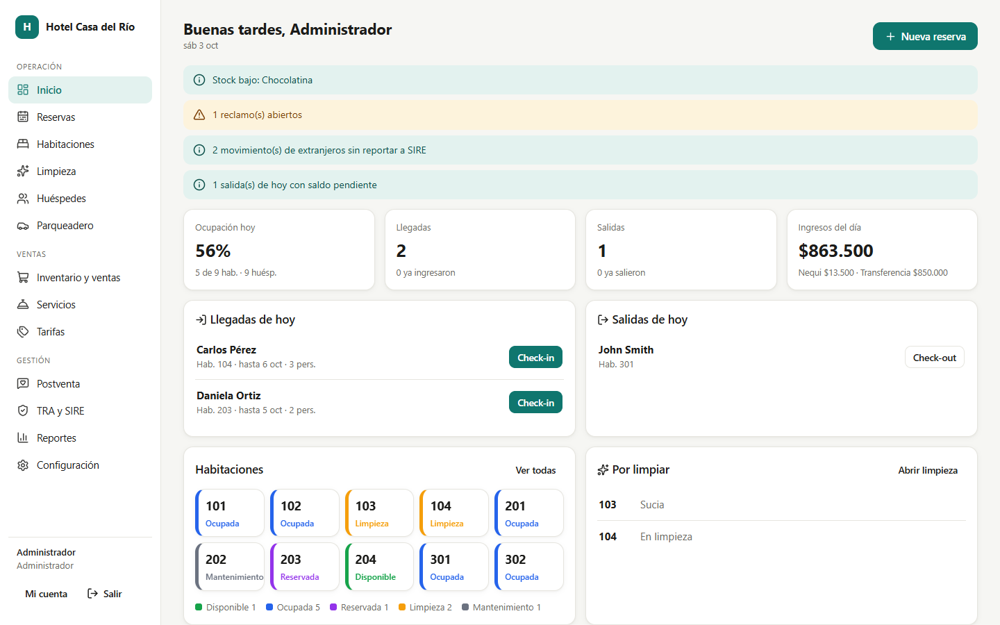
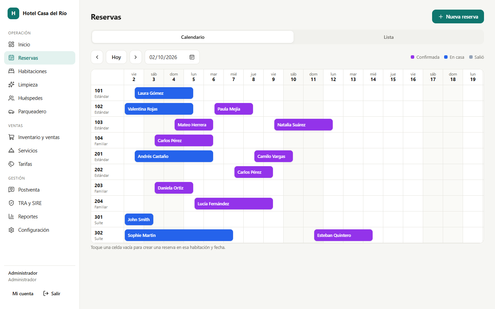
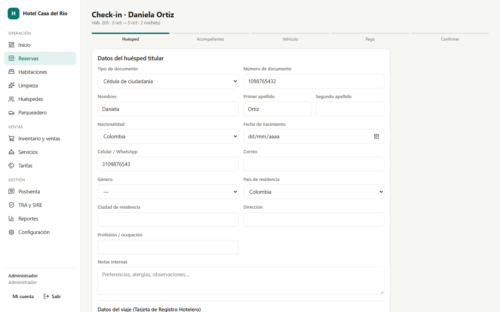
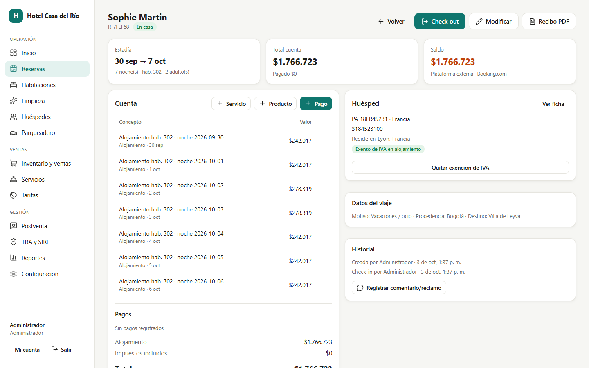
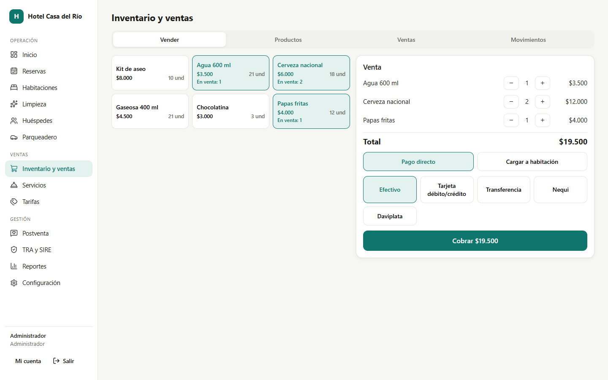
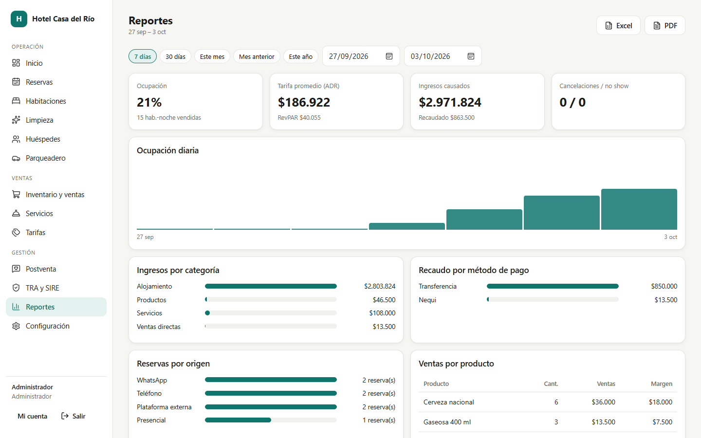
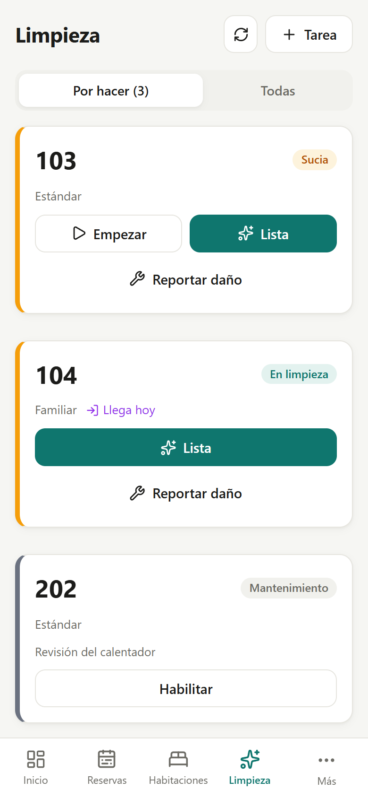
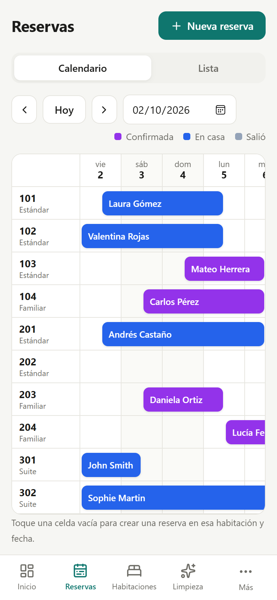

# Hotel PMS — Administración y recepción

Panel de administración para un hotel pequeño en Colombia (≈10 habitaciones), en español y COP, pensado para usarse desde el celular.

**Estado:** en curso · Caso de estudio: https://andreymartinezportafolio.vercel.app/proyectos/hotel-pms

| Inicio del día | Calendario de reservas |
|---|---|
|  |  |
| **Check-in por pasos** | **Cuenta del huésped** |
|  |  |
| **Punto de venta** | **Reportes** |
|  |  |

<p>
  
  
</p>

*Capturas con datos ficticios.*

## Puesta en marcha

Requisitos: Node.js 22.13 o superior (usa el módulo SQLite nativo `node:sqlite`; no hay que compilar nada).

```bash
npm install
npm run build
npm start
```

Abra http://localhost:3000. La primera vez se crea la base `data/hotel.db` con datos de ejemplo (habitaciones, productos y algunas reservas).
Para empezar sin reservas de ejemplo: `SEED_DEMO=0 npm start` con la carpeta `data/` vacía.

| Usuario     | Contraseña     | Rol            |
|-------------|----------------|----------------|
| `admin`     | `admin123`     | Administrador  |
| `recepcion` | `recepcion123` | Recepción      |
| `limpieza`  | `limpieza123`  | Limpieza       |

**Cambie estas contraseñas** en Configuración → Usuarios (el inicio lo recuerda mientras sigan activas).

Desarrollo con recarga: `npm run dev` (API en :3000) y `npm run dev:web` (Vite en :5173 con proxy a la API).

Copia de seguridad: copie la carpeta `data/` (base de datos + fotos y documentos).

## Estructura

```
server/
  db.js              Esquema SQLite y utilidades
  seed.js            Datos iniciales
  lib/core.js        Configuración, fechas (America/Bogota), sesiones, permisos, auditoría, IVA
  lib/booking.js     Motor de disponibilidad, tarifas y cuenta (folio)  ← compartido con el futuro módulo web
  lib/pdf.js         Recibo y reportes en PDF
  lib/einvoice.js    Adaptadores de facturación electrónica
  routes/            API REST por módulo
web/src/
  pages/             Una pantalla por módulo
  components/        Formulario de huésped reutilizable
  ui.jsx, styles.css Componentes y estilos
```

## Módulos

Inicio (ocupación, llegadas, salidas, por limpiar, ingresos y alertas) · Habitaciones (cuadrícula por estado, fotos, comodidades, bloqueos) ·
Tarifas (temporadas, fin de semana, estadía larga, simulador) · Reservas (línea de tiempo habitaciones × días, lista, anticipos, origen,
cancelación y no show) · Check-in por pasos · Check-out con recibo PDF y paso a limpieza · Huéspedes (historial, documentos, notas) ·
Parqueadero · Servicios · Inventario y ventas (punto de venta directo o cargo a habitación) · Limpieza (vista móvil) ·
Postventa (encuesta por WhatsApp/correo, reclamos con seguimiento) · Reportes (Excel y PDF) · TRA y SIRE · Configuración y auditoría.

### Roles
- **Administrador**: todo, incluidas anulaciones de cargos, pagos y ventas, y las devoluciones.
- **Recepción**: reservas, huéspedes, check-in/out, cobros, ventas, limpieza, parqueadero, postventa y reportes legales.
- **Limpieza**: ver habitaciones y actualizar su estado o reportar daños.

Cada acción importante (cobros, anulaciones con motivo, cancelaciones, no show, check-in/out, cambios de precios y configuración) queda en `audit_log`
con el usuario y la hora; se consulta en Configuración → Auditoría.

## Decisiones de diseño

- **La reserva es la cuenta.** Cargos (`charges`) y pagos (`payments`) cuelgan de la reserva; los anticipos se registran antes de la llegada y
  el alojamiento se carga noche por noche al hacer check-in. Al cambiar fechas o habitación en casa, o al salir antes o después, las noches
  se reajustan solas (`syncLodgingCharges`). Nada se borra: se anula con motivo.
- **Estado de habitación derivado.** Se guarda la limpieza (`clean/dirty/in_progress`) y el mantenimiento; "ocupada" y "reservada" se calculan
  a partir de las reservas, así no se desincronizan.
- **IVA.** Configurable (precios con o sin IVA incluido, tasa por categoría). La exención del alojamiento para extranjeros no residentes
  (art. 481 lit. d E.T.) se aplica por reserva y recalcula las noches sin IVA. Los documentos de soporte (pasaporte, sello o permiso de ingreso) se guardan
  en la ficha del huésped, fuera de la carpeta pública. Valide tasas y exenciones con su contador.

## Preparado para reservas en línea

El interruptor está en Configuración → Reservas en línea (desactivado y bloqueado por ahora). Ya existe:

- `lib/booking.js` con `availableRooms({ from, to, guests, onlineOnly })`, `quoteRoom()` y `createReservation()`: la misma lógica que usa recepción.
- Estado `pending` + `hold_expires_at`: una reserva web sin pagar bloquea la habitación solo durante `online_booking.hold_minutes`; al vencer deja de contar.
- Origen `web` en los orígenes de reserva (inactivo) y el campo `rooms.online_bookable` por habitación.
- Rutas públicas separadas (`publicRouter`), con un lugar en `server/index.js` para montar `/api/public/booking/*`.

Para activarlo hay que agregar las rutas públicas (disponibilidad, cotización, crear reserva pendiente, confirmar tras el pago), la pasarela de pago
y la página pública, y quitar el bloqueo en `PUT /settings/online_booking`.

## Cumplimiento en Colombia

- **TRA (Tarjeta de Registro Hotelero, MinCIT).** El check-in captura documento, nacionalidad, fecha de nacimiento, residencia, procedencia, destino,
  motivo del viaje y acompañantes. En *TRA y SIRE* se exportan a Excel y se marcan como reportados. Si MinCIT publica un servicio web para PMS,
  la integración se agrega donde se arma `traRows()` en `server/routes/reports.js`.
- **SIRE (Migración Colombia).** Lista las entradas (E) y salidas (S) de cada extranjero, acompañantes incluidos, y genera un archivo plano
  separado por tabuladores para el cargue masivo. **Antes del primer reporte**, revise con la guía vigente del portal SIRE:
  1. el orden de campos (`SIRE_FIELDS` en `server/routes/reports.js`);
  2. los códigos de tipo de documento y de país (Configuración → Cumplimiento). Por defecto vienen PA=3 y CE=5; los países se configuran a medida que se necesiten.
- **Facturación electrónica.** Las facturas se arman a partir de la cuenta (`invoices`) y se envían mediante un adaptador (`server/lib/einvoice.js`).
  Por ahora quedan como borrador para emitirlas en el portal del proveedor. Para conectar un proveedor (Siigo, Alegra, Facture, etc.) se agrega
  un adaptador `send(invoice, cfg)` que devuelva el CUFE y el número. El recibo PDF no reemplaza la factura.
